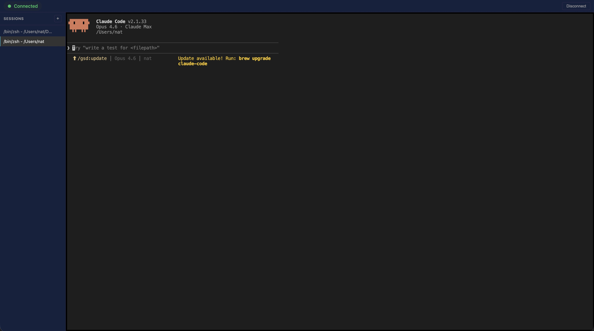

# Terminal Remote

Access your Mac's terminal sessions from any browser, anywhere.

A menu bar app runs on your Mac, connects to a relay server, and you open the relay's web UI from any device — iPad, laptop, phone — to see and interact with your terminal sessions.



## Install

```bash
curl -fsSL https://raw.githubusercontent.com/studium-ignotum/ignis-term/master/scripts/install.sh | bash
```

That's it. Services start immediately and auto-start on login.

To install a specific version:

```bash
VERSION=v2.2.0 curl -fsSL https://raw.githubusercontent.com/studium-ignotum/ignis-term/master/scripts/install.sh | bash
```

### What it does

- Installs Homebrew dependencies (`cloudflared`)
- Downloads the latest release for your architecture (Apple Silicon or Intel)
- Installs the menu bar app, relay server, and pty-proxy to `~/.terminal-remote/`
- Installs `Terminal Remote.app` to `~/Applications/`
- Configures shell integration (zsh, bash, or fish)
- Creates LaunchAgents so services auto-start on login and restart on crash

### Prerequisites

- **macOS** (Apple Silicon or Intel)
- **Homebrew** (for installing cloudflared)

### Shell integration

Add one line to your shell rc file so new terminal windows are automatically wrapped in pty-proxy and become remotely accessible:

```bash
# ~/.bashrc
source ~/.terminal-remote/init.bash

# ~/.zshrc
source ~/.terminal-remote/init.zsh

# ~/.config/fish/config.fish
source ~/.terminal-remote/init.fish
```

The pty-proxy is fully transparent — scroll, copy, mouse, and all terminal features work natively. Unlike tmux-based approaches, there are no compatibility issues with your terminal emulator.

## Uninstall

```bash
curl -fsSL https://raw.githubusercontent.com/studium-ignotum/ignis-term/master/scripts/uninstall.sh | bash
```

Removes the app, binaries, LaunchAgents, and shell integration.

## Architecture

```
┌─────────────┐     WebSocket     ┌──────────────┐     WebSocket     ┌─────────────┐
│  Mac Client │ ◄───────────────► │ Relay Server │ ◄───────────────► │  Browser UI │
│  (menu bar) │                   │  (Rust/Axum) │                   │  (React)    │
└──────┬──────┘                   └──────────────┘                   └─────────────┘
       │
       ├── pty-proxy (transparent PTY capture per shell)
       └── cloudflared (tunnel for remote access)
```

| Component | Directory | Language | Purpose |
|-----------|-----------|----------|---------|
| **Mac Client** | `mac-client/` | Rust | Menu bar app, manages pty-proxy sessions, bridges to relay |
| **PTY Proxy** | `pty-proxy/` | Rust | Transparent PTY wrapper that captures terminal I/O |
| **Relay Server** | `relay-server/` | Rust | Routes WebSocket messages between Mac and browsers |
| **Web UI** | `relay-server/web-ui/` | TypeScript/React | Terminal UI with xterm.js, embedded in relay binary |
| **Shell Integration** | `shell-integration/` | Bash/Zsh/Fish | Auto-wraps new shells in pty-proxy |

## How it works

### Connection flow

1. **Mac client** starts and connects to the relay server via WebSocket
2. **Relay server** generates a 6-character session code
3. **Mac client** displays the code in the menu bar
4. **User** opens the relay URL in a browser and enters the code
5. **Relay** authenticates the browser and pairs it with the Mac client
6. **Browser** receives the session list and displays terminal tabs

### Terminal I/O

Each shell session is wrapped in a `pty-proxy` process that sits between the terminal emulator and the shell. The proxy forwards all I/O transparently while sending a copy to the mac-client via Unix socket.

```
Terminal.app
    ↕ PTY (transparent)
pty-proxy
    ├── ↕ Shell (zsh/bash/fish)
    └── → Unix socket → Mac client
                            → WebSocket to relay
                            → Relay broadcasts to browsers
                            → xterm.js renders output
```

Browser input flows in reverse: xterm.js → relay → mac-client → pty-proxy → shell.

### Session management

- Shell integration wraps each new interactive shell in a pty-proxy instance
- pty-proxy connects to the mac-client via Unix socket (`/tmp/terminal-remote.sock`)
- Each proxy sends a registration message (shell, pid, tty) on connect
- Session connect/disconnect events are broadcast to browsers as JSON control messages
- The relay maintains a scrollback buffer (1 MB) per session, replayed on browser reconnect

### Session codes

- 6 characters from `ABCDEFGHJKMNPQRSTVWXYZ23456789` (no lookalike chars)
- Case-insensitive entry
- Generated by the relay server using nanoid

## Configuration

### Environment variables

**Relay Server:**
```bash
PORT=3000  # Listen port (default: 3000)
```

**Mac Client:**
```bash
RELAY_URL=ws://localhost:3000/ws  # Relay WebSocket URL (default)
```

## Development

### Tech stack

| Layer | Technology |
|-------|------------|
| **Mac Client** | Rust, Tokio, tray-icon, muda, tokio-tungstenite |
| **PTY Proxy** | Rust, nix (PTY/fork/poll), Unix sockets |
| **Relay Server** | Rust, Axum, Tokio, rust-embed, DashMap |
| **Web UI** | React 19, TypeScript 5, Vite 6, xterm.js 6, Zod |
| **Infrastructure** | cloudflared, Homebrew, LaunchAgents |

### Building

```bash
# Mac client
cargo build -p mac-client

# PTY proxy
cargo build -p pty-proxy

# Relay server (build web UI first)
cd relay-server/web-ui && pnpm build
cargo build -p relay-server

# Web UI only
cd relay-server/web-ui && pnpm build
```

### Running locally

```bash
# Terminal 1: Relay server
cargo run -p relay-server

# Terminal 2: Mac client
cargo run -p mac-client

# Terminal 3: Web UI dev server (optional, for HMR)
cd relay-server/web-ui && pnpm dev
```

Access via `http://localhost:5173` (Vite dev) or `http://localhost:3000` (relay with embedded UI).

### Testing

```bash
cargo test -p mac-client
cargo test -p relay-server
```

### Project structure

```
ignis-term/
├── mac-client/                    # Rust menu bar application
│   └── src/
│       ├── main.rs                # Entry point, event loop, menu
│       ├── app.rs                 # App state, event types
│       ├── protocol.rs            # Control message serialization
│       ├── relay/                 # WebSocket client with auto-reconnect
│       └── pty/mod.rs             # PTY proxy session management
│
├── pty-proxy/                     # Transparent PTY wrapper
│   └── src/
│       └── main.rs                # PTY fork, I/O forwarding, Unix socket
│
├── relay-server/                  # Rust relay server
│   ├── src/
│   │   ├── main.rs                # Axum server setup
│   │   ├── state.rs               # Session state, scrollback buffer
│   │   ├── protocol.rs            # Control message enum
│   │   ├── session.rs             # Session code generation
│   │   └── handlers/ws.rs         # WebSocket handler (mac + browser)
│   │
│   ├── web-ui/                    # React web application
│   │   └── src/
│   │       ├── App.tsx
│   │       ├── routes/            # LoginPage, TerminalPage
│   │       ├── lib/context/       # Connection, Terminal, Tabs contexts
│   │       ├── lib/components/    # Terminal, TerminalTabs, etc.
│   │       └── shared/            # Constants, protocol schemas
│   │
│   └── assets/                    # Built web UI (embedded in binary)
│
├── shell-integration/             # Shell init scripts (bash/zsh/fish)
└── scripts/                       # install.sh, uninstall.sh
```

## Remote access with Cloudflare Tunnel

The Mac client automatically spawns `cloudflared` to create a tunnel, providing a public HTTPS URL displayed in the menu bar. No manual tunnel setup required.

For manual tunnel creation:

```bash
# Start relay server
cargo run -p relay-server &

# Create a quick tunnel
cloudflared tunnel --url http://localhost:3000
```

Use the generated URL (e.g., `https://random-words.trycloudflare.com`) in your browser.

## Troubleshooting

### Session code not working

- Codes are case-insensitive
- Ensure the Mac client is still connected to the relay (check menu bar status)
- Restart the Mac client if needed

### Terminal not displaying output

1. Check that the pty-proxy is running: `pgrep pty-proxy`
2. Check the Mac client logs: `log stream --predicate 'process == "mac-client"'`
3. Verify the relay server is running

### Browser shows "Disconnected"

- Check the relay server is still running
- The connection will auto-reconnect with exponential backoff
- Refresh the page if reconnection fails

## Security notes

- Session codes provide access control (not authentication)
- Terminal input is passed directly to the shell (no sanitization)
- For production use, consider adding proper authentication and TLS
- Cloudflare Tunnel provides encrypted transport for remote access
