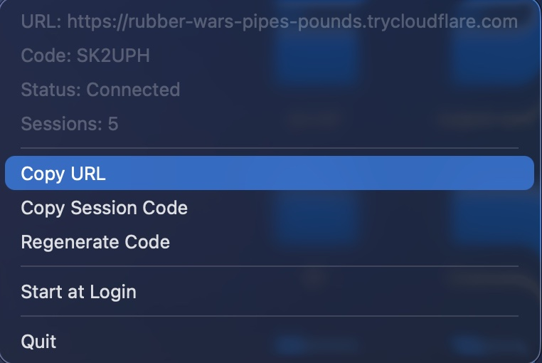

# Mac Client

A macOS menu bar application that manages remote terminal sessions.

| Menu Bar | Web UI |
|----------|--------|
|  |  |

## Overview

This component runs on the user's Mac and:
1. Sits in the menu bar with a tray icon showing connection status
2. Spawns the relay server and cloudflared tunnel as child processes
3. Accepts pty-proxy connections via Unix socket (`/tmp/terminal-remote.sock`)
4. Bridges terminal I/O between local shells and the relay server via WebSocket
5. Displays session code, tunnel URL, and session count in the menu bar

## Architecture

```
┌─────────────────────────────────────────────────────────────────┐
│ Mac Client (menu bar app)                                       │
│                                                                 │
│  ┌──────────────┐    WebSocket    ┌────────────────────────┐   │
│  │ RelayClient   │ ◄────────────► │ Relay Server (child)   │   │
│  └──────────────┘                 └────────────────────────┘   │
│         │                                                       │
│         ▼                                                       │
│  ┌──────────────┐    Unix Socket   ┌─────────────────┐         │
│  │ PtyManager   │ ◄──────────────► │ pty-proxy       │         │
│  └──────────────┘                  │ (per session)    │         │
│                                    └─────────────────┘         │
│                                           │                     │
│                                           ▼                     │
│                                    ┌─────────────────┐         │
│                                    │ Shell PTY        │         │
│                                    │ (zsh/bash/fish)  │         │
│                                    └─────────────────┘         │
└─────────────────────────────────────────────────────────────────┘
```

## Files

| File | Purpose |
|------|---------|
| `src/main.rs` | Entry point, event loop, tray icon, menu bar, cloudflared tunnel |
| `src/app.rs` | App state, UI/background event types, channel definitions |
| `src/protocol.rs` | Control message serialization (shared with relay-server) |
| `src/relay/connection.rs` | WebSocket client with auto-reconnect and exponential backoff |
| `src/pty/mod.rs` | PTY proxy session management via Unix socket |
| `src/lib.rs` | Module declarations |

## Building

```bash
# Debug build
cargo build -p mac-client

# Release build
cargo build --release -p mac-client

# Build .app bundle (after release build)
./mac-client/build-bundle.sh
```

## Environment Variables

| Variable | Default | Description |
|----------|---------|-------------|
| `RELAY_URL` | `ws://localhost:3000/ws` | Relay server WebSocket URL |

## How It Works

### Terminal Output Flow

1. Shell integration wraps each shell in a `pty-proxy` instance
2. `pty-proxy` connects to mac-client via Unix socket (`/tmp/terminal-remote.sock`)
3. Proxy sends registration (shell, pid, tty) then streams length-prefixed output frames
4. `PtyManager` receives output and forwards to `RelayClient`
5. `RelayClient` sends binary WebSocket frames to the relay server
6. Relay broadcasts to connected browsers

### User Input Flow

1. `RelayClient` receives binary WebSocket frames from relay (browser input)
2. Frames are parsed and forwarded to `PtyManager`
3. `PtyManager` sends JSON input messages to the appropriate pty-proxy via Unix socket
4. pty-proxy writes to the shell PTY

### Process Lifecycle

1. Mac client starts and spawns relay-server as a child process
2. Spawns cloudflared tunnel pointing at `http://localhost:3000`
3. Connects to relay via WebSocket and receives a session code
4. Listens on Unix socket for pty-proxy connections
5. On quit, kills cloudflared and relay-server child processes

### Menu Bar

The tray icon menu displays:
- Tunnel URL (with copy action)
- Session code (with copy action)
- Connection status
- Active session count
- Regenerate code, start at login, and quit actions

## Dependencies

| Crate | Purpose |
|-------|---------|
| `tray-icon`, `muda` | System tray icon and menu |
| `winit` | macOS event loop |
| `tokio`, `tokio-tungstenite`, `futures-util` | Async runtime and WebSocket |
| `arboard` | Clipboard access |
| `serde`, `serde_json` | JSON serialization |
| `uuid` | Session ID generation |
| `tracing`, `tracing-subscriber` | Structured logging |
| `smappservice-rs` | Login item management (macOS SMAppService) |
| `image` | Tray icon loading |
| `libc` | Signal handling, process management |
